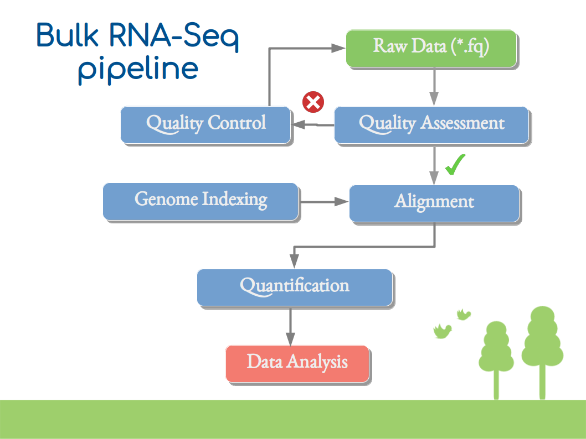

# Bulk RNA Seq data processing

Here, we describe our undergoing Bulk RNA Seq data processing pipeline and documentation. 
The following image shows a simplified overview of a standard protocol for transcriptome
quantification. 

Currently, we have implemented the Tuxedo pipeline as described 
[here](https://www.nature.com/articles/nprot.2016.095). Please, see the 
[wiki](https://github.com/caramirezal/bulk-rna-seq/wiki) for further
information.
